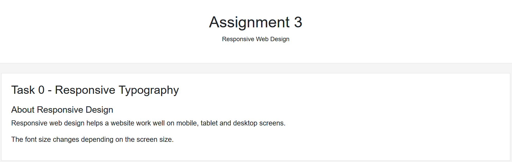
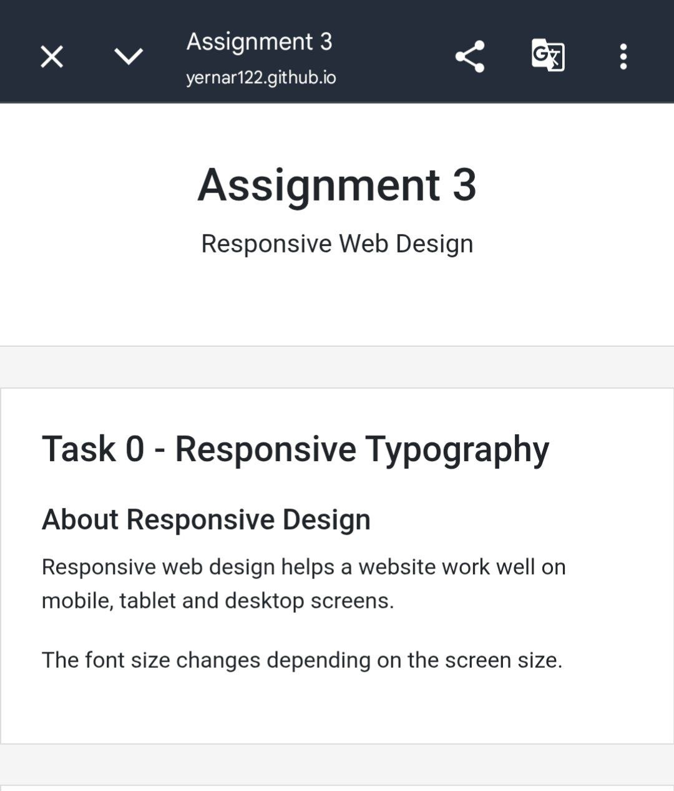
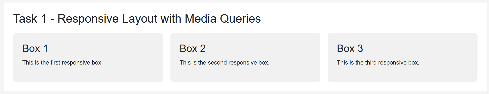
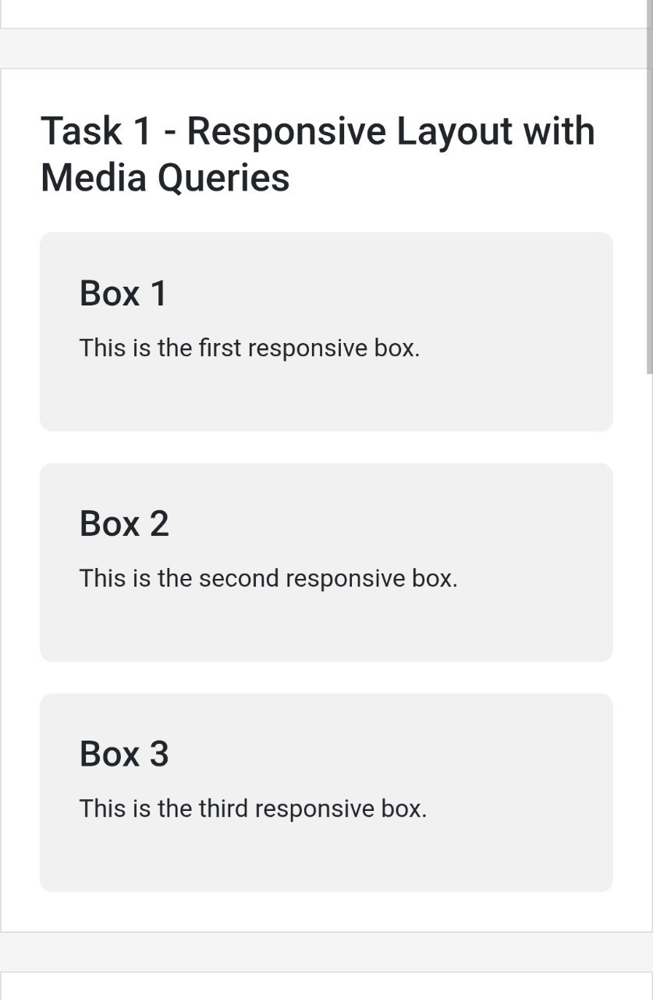
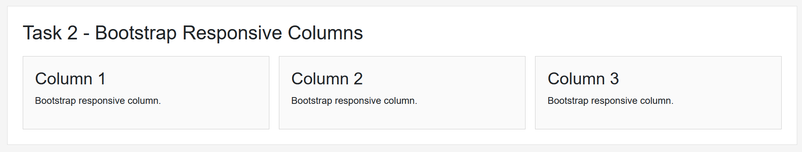
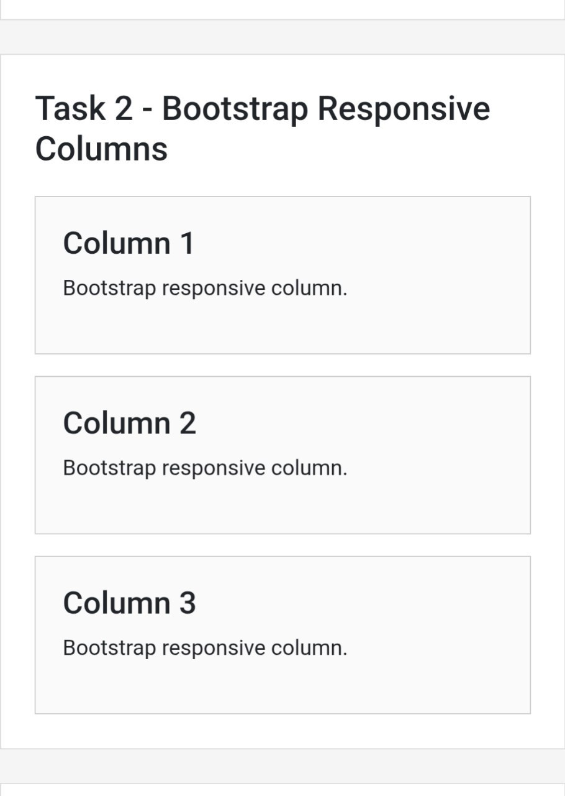
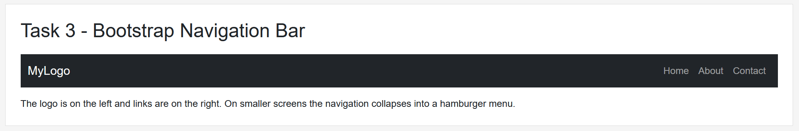
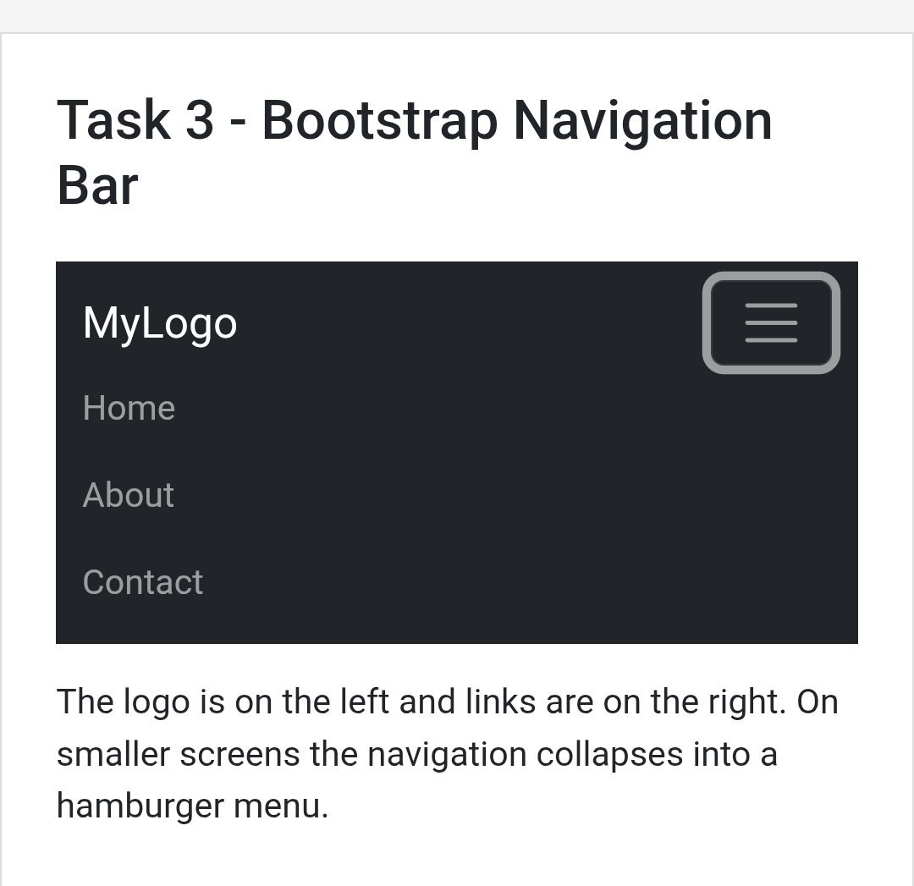
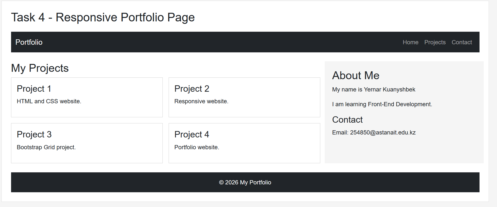

# Assignment 3 - Responsive Web Design

Name: Yernar Kuanyshbek
Group: SE-2539

## Task 0 - Responsive Typography

I created responsive headings and paragraphs.

The font size changes for mobile, tablet and desktop screens using CSS Media Queries.

Screenshot:

## Task 1 - Responsive Layout with Media Queries

I created three responsive boxes using only HTML and CSS Media Queries.

- Desktop: three boxes in one row
- Tablet: two boxes in one row
- Mobile: boxes are stacked vertically

Screenshot:

## Task 2 - Bootstrap Responsive Columns

I used the Bootstrap 12-column grid system.

The main classes are:
col-12 col-md-6 col-lg-4

- Mobile: one column per row
- Tablet: two columns per row
- Desktop: three columns per row

Screenshot:

## Task 3 - Bootstrap Navigation Bar

I created a responsive Bootstrap navigation bar.

It contains:

- Logo
- Home link
- About link
- Contact link

On smaller screens, the navigation menu collapses into a hamburger menu.

Screenshot:

## Task 4 - Responsive Portfolio Page

I created a responsive portfolio page using Bootstrap Grid and CSS Media Queries.

The page contains:

- Bootstrap navbar
- Project cards
- Sidebar with personal information
- Contact information
- Footer

Custom Media Queries are used to change font sizes, spacing and element visibility.

Screenshot:

## Summary

In this assignment, I learned how to create responsive web pages using CSS Media Queries and Bootstrap.

I practiced responsive typography, responsive layouts, Bootstrap Grid, responsive navigation bars and a complete responsive portfolio page.
